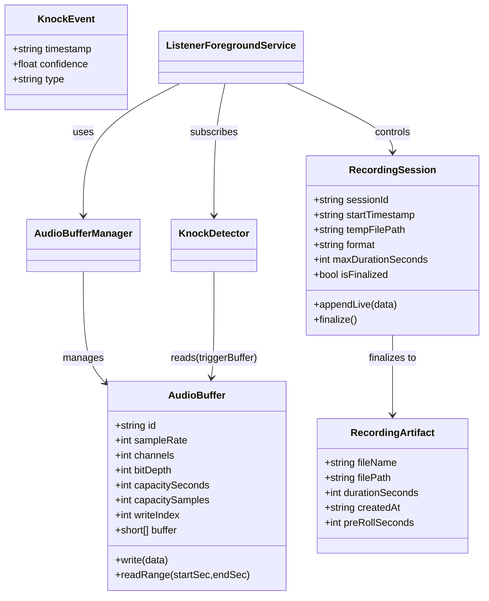

# Spec 01 — Data Model (Authoritative)

Purpose: provide a compact, authoritative data model for in-memory buffers, detection events, transient recording sessions, and persisted artifacts. Use this as the canonical reference for implementation and tests.


## Entities (fields table)

Below are canonical entities with their fields. These names are authoritative — implementation and tests must use them unless explicitly changed here.

AudioBuffer (ring buffer)

| Field | Type | Notes |
|---|---:|---|
| `id` | string | `trigger` or `content` — identifies purpose |
| `sampleRate` | int | Hz (e.g., 8000) |
| `channels` | int | 1 (mono) |
| `bitDepth` | int | e.g., 16 |
| `capacitySeconds` | int | configured duration in seconds |
| `capacitySamples` | int | computed: `sampleRate * capacitySeconds` |
| `writeIndex` | int | 0..capacitySamples-1 |
| `buffer` | short[] | raw PCM backing storage (implementation) |

Core methods: `write(short[] data)`, `readRange(startSec, endSec) -> short[]` (must handle wrap-around efficiently).

KnockEvent

| Field | Type | Notes |
|---|---:|---|
| `timestamp` | string (ISO-8601) | detection time (UTC)
| `confidence` | number | 0..1 score from detector
| `type` | string | `single` or `double`

RecordingSession (in-progress)

| Field | Type | Notes |
|---|---:|---|
| `sessionId` | string | UUID
| `startTimestamp` | string | ISO-8601 anchor (pre-roll origin)
| `tempFilePath` | string | path to temp file (app cache)
| `format` | string | `aac` or `wav` (or `pcm` for temp)
| `maxDurationSeconds` | int | auto-stop timeout (default 300)
| `isFinalized` | boolean | true once moved to permanent storage

Core methods: `appendLive(short[] data)`, `finalize() -> RecordingArtifact`.

RecordingArtifact (persisted)

| Field | Type | Notes |
|---|---:|---|
| `fileName` | string | `recording-YYYYMMDD-HHMMSS.ext`
| `filePath` | string | absolute path in app storage
| `createdAt` | string | ISO-8601 creation time
| `durationSeconds` | int | total recorded duration
| `preRollSeconds` | int | included pre-roll duration
| `sampleRate` | int | 8000
| `channels` | int | 1
| `bitDepth` | int | 16
| `detectedKnocks` | array of KnockEvent | list of knocks for diagnostics

Sidecar: a JSON sidecar with the same basename and `.json` extension MUST be written for every finalized `RecordingArtifact` (schema below).

## Class Diagram




## Sidecar JSON Schema (canonical)

The following is the canonical JSON Schema for the sidecar written alongside each persisted recording.

```json
{
  "$schema": "http://json-schema.org/draft-07/schema#",
  "title": "Watnu Recording Artifact",
  "type": "object",
  "required": ["fileName","filePath","createdAt","durationSeconds","preRollSeconds","sampleRate","channels","detectedKnocks"],
  "properties": {
    "fileName": {"type":"string"},
    "filePath": {"type":"string"},
    "createdAt": {"type":"string","format":"date-time"},
    "durationSeconds": {"type":"integer","minimum":0},
    "preRollSeconds": {"type":"integer","minimum":0},
    "sampleRate": {"type":"integer"},
    "channels": {"type":"integer"},
    "detectedKnocks": {
      "type":"array",
      "items": {
        "type":"object",
        "required": ["timestamp","confidence","type"],
        "properties": {
          "timestamp": {"type":"string","format":"date-time"},
          "confidence": {"type":"number","minimum":0,"maximum":1},
          "type": {"type":"string","enum":["single","double"]}
        }
      }
    }
  }
}
```

    ## Canonical Kotlin data-classes (implementation aid)

    These concise Kotlin data-class definitions are provided as a non-binding implementation aid; field names must match the spec where noted.

    ```kotlin
    data class KnockEvent(
      val timestamp: String, // ISO-8601 UTC
      val confidence: Float,
      val type: String // "single" | "double"
    )

    data class RecordingArtifact(
      val fileName: String,
      val filePath: String,
      val createdAt: String,
      val durationSeconds: Int,
      val preRollSeconds: Int,
      val sampleRate: Int,
      val channels: Int,
      val bitDepth: Int,
      val detectedKnocks: List<KnockEvent>
    )

    data class RecordingSession(
      val sessionId: String,
      val startTimestamp: String,
      val tempFilePath: String,
      val format: String,
      val maxDurationSeconds: Int = 300,
      var isFinalized: Boolean = false
    )
    ```

## Runtime State Machine (compact)

| State | Description | Event -> Next State |
|---|---|---|
| Standby | Service running, buffers active, not recording | `singleKnockDetected` -> ActiveRecording |
| ActiveRecording | RecordingSession exists, appending live audio | `doubleKnockDetected` -> Finalizing; `maxDurationReached` -> Finalizing |
| Finalizing | IO thread finalizes artifact and sidecar | on success -> Standby |

## Contract Summary

- Inputs: continuous PCM audio (mono, 8 kHz, 16-bit) fed to `AudioBufferManager.write()`.
- Outputs: `RecordingArtifact` persisted to `WatnuRecordings/` plus a JSON sidecar matching the schema above.
- Error modes: IO failures, permission revocation, detector false positives/negatives, buffer underrun/overrun.

## Operational Notes / Edge Cases

- Reads across the wrap boundary MUST be implemented as two contiguous copies (tail, then head) and re-stitched in order.
- Temp files: use atomic rename on finalize to avoid partial artifacts.
- Low-memory: fall back to smaller `capacitySeconds` or spill-to-disk circular buffer; document as configuration.
- False positives: sidecar `detectedKnocks` provides telemetry for offline analysis.

## Example (short)

Sidecar snippet for a finalized file:

```json
{
  "fileName": "recording-20250904-123045.aac",
  "filePath": "/data/data/com.example.app/WatnuRecordings/recording-20250904-123045.aac",
  "createdAt": "2025-09-04T12:30:45Z",
  "durationSeconds": 45,
  "preRollSeconds": 120,
  "sampleRate": 8000,
  "channels": 1,
  "detectedKnocks": [
    {"timestamp": "2025-09-04T12:29:05Z", "confidence": 0.87, "type": "single"},
    {"timestamp": "2025-09-04T12:30:30Z", "confidence": 0.92, "type": "double"}
  ]
}
```

---

This file is the canonical data-model reference for the prototype; implementation must conform to field names and sidecar schema unless a breaking change is deliberate and documented here.
